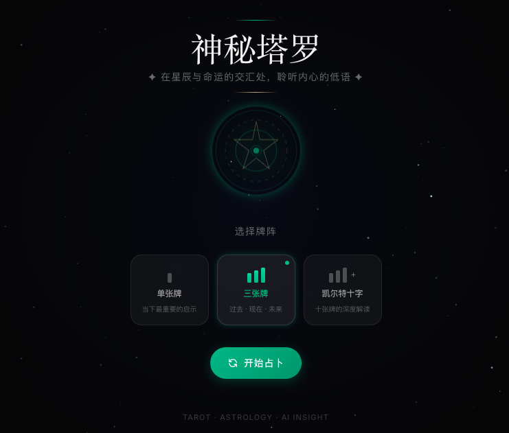

# MysticTarot — 兼具仪式感与交互美学的 AI 塔罗占卜系统



MysticTarot 是一个基于 **Nuxt 3**、**Three.js (TresJS)** 和 **OpenAI** 构建的高级在线塔罗占卜 Web 应用。它旨在通过深邃的暗黑美学、细腻的 3D 交互动画以及深度的 AI 解读，为用户提供极具仪式感的探索内心之旅。

## ✨ 核心特性

- **🔮 沉浸式交互体验**：利用 Three.js 与 GSAP 实现物理感十足的洗牌、扇形展牌及 3D 翻牌效果。
- **🤖 AI 深度解读**：集成 OpenAI API，支持流式 (SSE) 输出个性化的牌阵解读报告，语气温柔且富有洞察力。
- **🛡️ 智能降级方案**：在无 API Key 或网络波动时，自动回退至内置的 78 张牌地道中文释义数据库。
- **🌌 极简暗黑美学**：翡翠绿 (Emerald Glow) 配合深邃黑背景，结合动态星空粒子与毛玻璃 (Glassmorphism) UI。
- **🌍 多语言支持**：基于 `@nuxtjs/i18n` 的国际化架构，目前已完美适配地道的中文语境。
- **📱 响应式设计**：Mobile First 策略，完美适配 iOS/Android 浏览器及 PC 端。
- **🎵 环境音效**：内置环境背景音，增强冥想占卜的仪式感。

## 🛠️ 技术栈

- **框架**: [Nuxt 3](https://nuxt.com/) (Vue 3 + TypeScript)
- **3D 引擎**: [TresJS](https://tresjs.org/) / Three.js
- **动效**: [GSAP](https://gsap.com/)
- **样式**: [Tailwind CSS](https://tailwindcss.com/)
- **状态管理**: [Pinia](https://pinia.vuejs.org/)
- **工具库**: [VueUse](https://vueuse.org/)
- **AI**: OpenAI SDK (Streaming support)

## 🚀 快速开始

### 1. 克隆项目
```bash
git clone git@github.com:liuxinyea/MysticTarot.git
cd MysticTarot
```

### 2. 安装依赖
```bash
pnpm install
```

### 3. 环境配置
复制 `.env.example` 并重命名为 `.env`，填入你的 OpenAI API Key：
```bash
OPENAI_API_KEY=sk-xxxx...
```
*注：若不配置 Key，应用将自动运行在“本地解读模式”。*

### 4. 启动开发服务器
```bash
pnpm dev
```
访问 [http://localhost:3000](http://localhost:3000) 即可开始体验。

## 📁 目录结构

```text
├── assets/           # 静态资源、全局样式及原始数据
├── components/       # 可复用 Vue 组件 (3D 场景、UI 交互)
├── i18n/locales/     # 多语言翻译文件
├── pages/            # 页面路由 (核心逻辑位于 index.vue)
├── public/           # 静态托管资源 (牌面图片、JSON 数据库)
├── server/api/       # Nitro 后端接口 (AI 解读 SSE)
├── stores/           # Pinia 状态管理
├── types/            # TypeScript 类型定义
└── utils/            # 通用工具函数
```

## 🤝 贡献指南

欢迎提交 Issue 或 Pull Request 来完善这个项目。无论是 UI 优化、新的牌阵建议还是多语言翻译，我们都非常期待！

## 📄 开源协议

本项目基于 [MIT License](LICENSE) 协议开源。

---
*愿星辰指引你找到内心的答案。💚*
